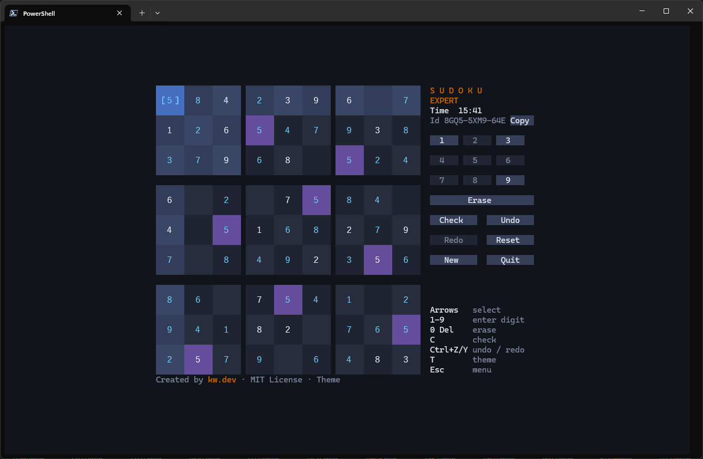

# SudokuGen

[](https://www.nuget.org/packages/SudokuGen)
[](https://www.nuget.org/packages/SudokuGen)
[](https://github.com/kwdevhq/sudoku-gen/actions/workflows/pr.yml)
[](https://github.com/kwdevhq/sudoku-gen/actions/workflows/release.yml)
[](LICENSE)
[](https://dotnet.microsoft.com)

A fast .NET library that generates sudoku puzzles, and a terminal game that uses it.

- **Fast.** It does not solve boards. It transforms known seed puzzles. One generation takes a few small allocations.
- **Reproducible.** Each sudoku has an id such as `DHS6-RJN0-C38`. The same id always gives the same sudoku.
- **Four difficulties.** Easy, medium, hard and expert.
- **Tested.** The code has 100% line and branch coverage. Only terminal glue code in the TUI is exempt ([ADR 0005](docs/adr/0005-minimal-coverage-exemption-for-terminal-glue.md)). The PR pipeline fails below 100%.

## Try it in the terminal



The TUI is a sudoku game for the terminal. It supports mouse and keyboard, autosave and statistics.

Windows x64. Open PowerShell and run:

```powershell
iex (irm https://raw.githubusercontent.com/kwdevhq/sudoku-gen/main/scripts/install.ps1)
sudoku-tui
```

The script checks the SHA256 checksum, installs to `%LOCALAPPDATA%\kwdevhq\sudoku-tui` and adds that folder to your user PATH. It needs no administrator rights and no .NET. Run it again to upgrade.

To select a version or to remove the game, run the script with a parameter:

```powershell
& ([scriptblock]::Create((irm https://raw.githubusercontent.com/kwdevhq/sudoku-gen/main/scripts/install.ps1))) -Version 1.0.0
& ([scriptblock]::Create((irm https://raw.githubusercontent.com/kwdevhq/sudoku-gen/main/scripts/install.ps1))) -Uninstall
```

Uninstall keeps your save and statistics files.

Linux and macOS: coming soon. Until then, use `dotnet run --project src/samples/SudokuGen.Tui` with the .NET 10 SDK.

## Use the library

```
dotnet add package SudokuGen
```

```csharp
using SudokuGen;

Sudoku any = SudokuGenerator.Generate();
Sudoku hard = SudokuGenerator.Generate(Difficulty.Hard);

// Reproduce exactly the same sudoku later (no randomness involved)
SudokuId id = SudokuId.Parse(any.Id.ToString());   // e.g. DHS6-RJN0-C38
Sudoku again = SudokuGenerator.FromId(id);

// Seeded Random only affects which new id is picked
Sudoku picked = SudokuGenerator.Generate(Difficulty.Easy, random: new Random(42));
```

`Sudoku` has `Puzzle`, `Solution`, `Difficulty` and `Id`. `Puzzle` and `Solution` are 81-character row-major strings. `Puzzle` uses `-` for cells the player must fill in.

```
Puzzle:   41--75-----53--7--2-36-81--7-9--25-1-3--9-47--2-1-7---6587--9-----26-8--1925---47
Solution: 416975238985321764273648159769432581531896472824157396658714923347269815192583647
```


## How it works

SudokuGen does not solve and remove clues, which is slow. It starts from a known seed puzzle with a unique solution. Then it applies random transformations:

- rotate the board (4 ways)
- shuffle the stacks (3!) and the bands (3!)
- shuffle the columns inside each stack (6³) and the rows inside each band (6³)
- relabel the digits (9!)

Each seed gives more than 2.4 trillion different puzzles.

## Inspired by

SudokuGen is a .NET port of [petewritescode/sudoku-gen](https://github.com/petewritescode/sudoku-gen) by Pete Williams (MIT). The seed-and-transform method comes from that project. See [NOTICE.md](NOTICE.md).

## Repository layout

| Path | Purpose |
| --- | --- |
| `src/core` | The library (NuGet package `SudokuGen`) |
| `src/tests/SudokuGen.Tests` | Tests, including unique-solution checks |
| `src/samples/SudokuGen.Cli` | Minimal command-line sample |
| `src/samples/SudokuGen.Tui` | The terminal game |
| `src/benchmarks/SudokuGen.Benchmarks` | Generation benchmarks |

Every sample uses the same library.

## Built with

- [Terminal.Gui](https://github.com/gui-cs/Terminal.Gui): the terminal user interface
- [TUnit](https://github.com/thomhurst/TUnit): the test framework and coverage
- [BenchmarkDotNet](https://github.com/dotnet/BenchmarkDotNet): the benchmarks

## Development

You need the .NET 10 SDK.

```
dotnet run --project src/samples/SudokuGen.Cli -- --difficulty hard --solution
dotnet run --project src/samples/SudokuGen.Cli -- --id DHS6-RJN0-C38 --format json
dotnet run --project src/samples/SudokuGen.Tui
dotnet test --solution src/SudokuGen.slnx --coverage
pwsh scripts/coverage-report.ps1   # per-line HTML report (coverage-report/index.html)
pwsh scripts/check.ps1             # all CI gates: format, warnings as errors, 100% coverage
dotnet run -c Release --project src/benchmarks/SudokuGen.Benchmarks -- --filter '*'   # add --job short for a quick run
```

Enable the pre-commit hook once with `git config core.hooksPath .githooks`.
For terms and decisions, see [GLOSSARY.md](GLOSSARY.md) and [docs/adr](docs/adr). For the rules of the code, see [CODING_STANDARDS.md](CODING_STANDARDS.md). AI agents: see [AGENTS.md](AGENTS.md). For releases, see [docs/releasing.md](docs/releasing.md).

## Feedback

Found a bug? Have an idea? [Open an issue](https://github.com/kwdevhq/sudoku-gen/issues/new). Include your Sudoku id, if you have one, and the steps to repeat the problem.

You can also send a pull request. Open an issue first for large changes. Run `pwsh scripts/check.ps1` before you push.

## License

MIT. The core is derived from the original by Pete Williams. The port, its extensions and everything else are by [kw.dev gmbh](https://kw.dev). See [LICENSE](LICENSE).
